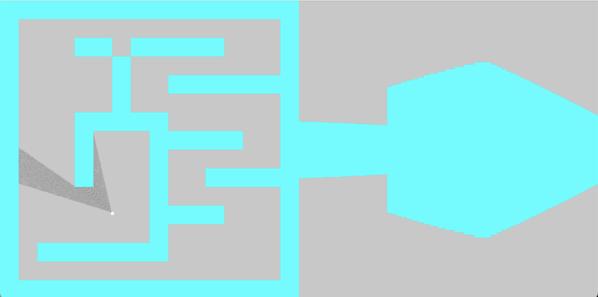
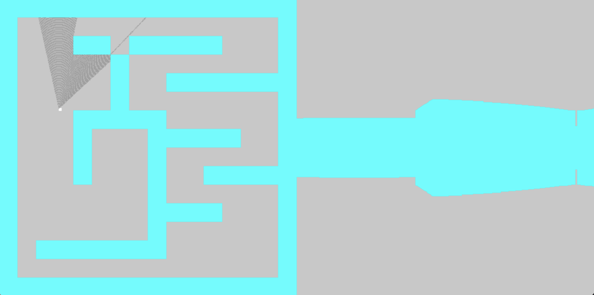

# RaycasterDemo
This is a live demonstation of the optical tricks of projecting a 2d map to a first person field of view, or FOV.

## Building the Project 
1. Clone this repo:
    '''
    git clone https://github.com/denglish04/raycasterDemo
    '''

2. Navigate to the project folder
    '''
    cd RaycasterDemo
    '''
3. Compile 
    '''
    g++ main.cpp -0 raycaster
    '''

## Screenshots
    
    
    

