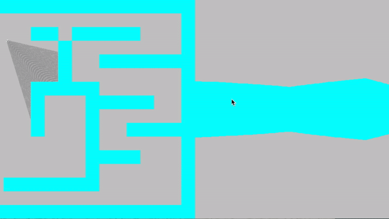

# RaycasterDemo
This live demonstation shows the process of projecting a 2D map to a first person optical field of view, or FOV. In game development this is also known as first person. 

## Demo

The left half of this demo displays the 2D birds eye view of a 16x16 grip map as well as the players position, and the raycasting done to determine the players distance from walls in the field of view. The right half of this demo displays the first person field of view from the players perspective. 


## Building the Project 
1. Clone this repo:
    ```
    git clone https://github.com/denglish04/raycasterDemo
    ```

2. Navigate to the project folder
    ```
    cd RaycasterDemo/src
    ```
3. Compile 
    ```
    g++ gameloop.cpp -0 raycaster
    ```
4. Run
    ```
    ./gameloop
    ```


## Screenshots
    
    
    


