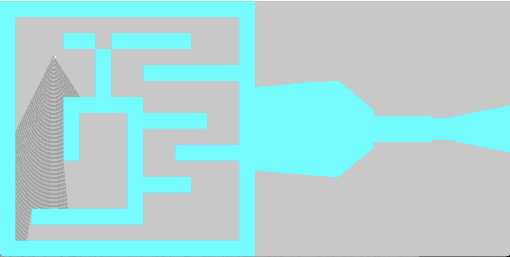

# RaycasterDemo
This is a live demonstation of the optical tricks of projecting a 2d map to a first person field of view, or FOV.

## Demo


## Building the Project 
1. Clone this repo:
    ```
    git clone https://github.com/denglish04/raycasterDemo
    ```

2. Navigate to the project folder
    ```
    cd RaycasterDemo/src
    ```
3. Compile 
    ```
    g++ gameloop.cpp -0 raycaster
    ```
4. Run
    ```
    ./gameloop
    ```


## Screenshots
    
    
    


